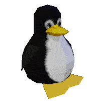

  

  

**Full Stack Developer**

---

## Hola!

  

---

## Tecnologías y herramientas

**Frontend**

  
  
  

**Backend**

  
  
  
  

**Bases de datos**

  
  

**Herramientas e infraestructura**

  
  
  

---

## Estadísticas

  
  

---

## Dónde encontrarme

  
  
  

---

*""El gran hermano te vigila.""*

**¡Gracias por visitar!** Si alguno de mis repos te es útil, no olvides dejar una estrella.

